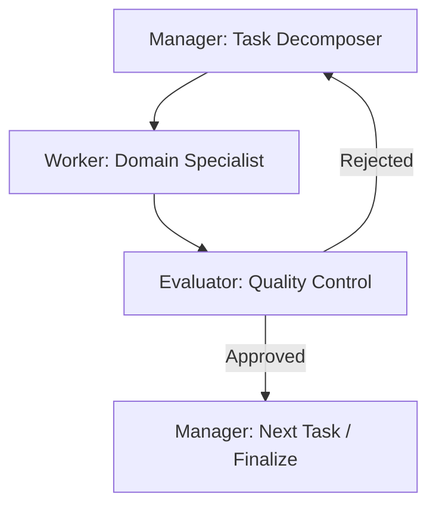

# Developer Assistant Agentfile

## Systematic Analytical Approach

This document defines the rigorous, step-by-step analytical approach for the Codemate-Hub developer assistant agents. All agents must adhere to these principles to ensure high-quality, idempotent, and maintainable code.

### Phase 1: Discovery & Analysis
1.  **Context Gathering**: Read all relevant project documentation (`README.md`, `TOOLING.md`, `trackers/`, etc.).
2.  **Requirement Decomposition**: Break down the user request into atomic, manageable tasks.
3.  **Dependency Mapping**: Identify internal and external dependencies for each task.
4.  **Risk Assessment**: Identify potential blockers, security risks, or performance bottlenecks.

### Phase 2: Design & Planning
1.  **Architecture Alignment**: Ensure the proposed solution fits within the existing containerized multi-service architecture.
2.  **Idempotency Design**: All scripts and configurations must be idempotent (safe to run multiple times).
3.  **Interface Definition**: Define clear contracts between services and agents.
4.  **Test Planning**: Define success criteria and test cases for each task.

### Phase 3: Implementation (Worker Agents)
1.  **Atomic Commits**: Work in small, logical increments.
2.  **Best Practices**: Adhere to language-specific best practices (e.g., PEP 8 for Python, idiomatic Rust).
3.  **Documentation**: Include inline comments and update relevant project documentation.
4.  **Self-Correction**: Run local tests and linting before submitting for review.

### Phase 4: Quality Control (Evaluator Agent)
1.  **Rigorous Review**: Evaluate work against requirements, best practices, and security standards.
2.  **Gating**: Kick back subpar work with detailed analysis and guidance for improvement.
3.  **Approval**: Only approve work that meets all success criteria.
4.  **Feedback Loop**: Provide notes to the Manager for the next iteration or task routing.

### Phase 5: Deployment & Validation
1.  **Automated Deployment**: Use scripts to automate the deployment process.
2.  **Health Checks**: Implement and verify health and readiness checks.
3.  **LAN Access Verification**: Ensure WebUI and shell access are available from the LAN.
4.  **Performance Monitoring**: Verify resource usage and GPU acceleration.

## Multi-Agentic Workflow

### Roles & Responsibilities

*   **Manager**: Decomposes work, routes tasks, manages the overall workflow state.
*   **Worker**: Implements specific tasks (Python, Rust, DevOps, etc.).
*   **Evaluator**: Performs forensic audits, ensures quality gating, and provides constructive feedback.

## Project-Specific Best Practices
*   Use `uv` for Python dependency management.
*   Maintain container health checks in `docker-compose.yml`.
*   Ensure all scripts use absolute paths and color-coded logging.
*   Follow the established directory structure (`src/`, `scripts/`, `zephyr/`, etc.).
